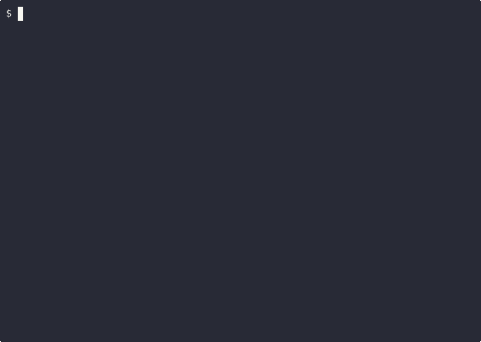
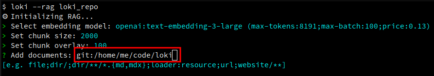

# RAG
Retrieval Augmented Generation (RAG) is a method of minimizing LLM hallucinations and extending the model's context 
without consuming a significant portion of the context length. It uses documents and other additional resources that you
provide to give the model more context for all of your prompts.

Loki has a built-in vector database and full-text search engine to support RAG knowledge bases for your queries.

The generated knowledge bases are stored in the `rag` subdirectory of your Loki configuration directory. The location of 
this directory varies by system, so you can use the following command to find your RAG directory:

```shell
loki --info | grep 'rags_dir' | awk '{print $2}'
```

## Quick Links
<!--toc:start-->
- [Usage](#usage)
  - [Persistent RAG](#persistent-rag)
  - [Ephemeral RAG](#ephemeral-rag)
- [How It Works](#how-it-works)
    - [1. Build](#1-build)
    - [2. Lookup](#2-lookup)
    - [2a. Reranking (Optional)](#2a-reranking-optional)
    - [3. Prompt](#3-prompt)
- [Supported Document Sources](#supported-document-sources)
- [Document Loaders](#document-loaders)
  - [Document Loader Usage](#document-loader-usage)
- [Advanced Customizations](#advanced-customizations)
  - [Embedding Model](#embedding-model)
  - [Reranker](#reranker)
  - [Chunk Size](#chunk-size)
    - [Trade-Offs](#chunk-size-trade-offs)
  - [Chunk Overlap](#chunk-overlap)
  - [Top K](#top-k)
    - [Trade-Offs](#top-k-trade-offs)
  - [RAG Template](#rag-template)
<!--toc:end-->

---

## Usage
There's two ways to use RAG in Loki: A persistent RAG that can be loaded on-demand for queries, and an ephemeral one for
adding RAG to a single specific query.

### Persistent RAG
In the REPL, persistent RAG is initialized via the `.rag` command:



The generated RAG is then saved to the `rag` subdirectory of the Loki configuration, and can then be loaded whenever you
want that knowledge base via either `.rag <name>` or `loki --rag <RAG>`.

### Ephemeral RAG
Short-lived RAG that is only used for a single session or query is loaded using `.file`/`--file`.

You can use it to either execute a prompt from a file, or for temporary RAG. The difference is the usage of the `--` 
separator. If you only specify a filename and no `--` separator, Loki will know to read the file contents and pass them 
as a query to the model. Otherwise, the `--` separator is read to indicate that this is the end of the list of documents
to load into the ephemeral RAG, and what follows is the query to pass to the model.

```shell
.file prompt.md # Read the file as a prompt
.file %% -- translate the last reply to italian
.file `git diff` -- generate a commit message
```


Once the session ends, this RAG will no longer be accessible and is only visible to the current session.

#### The `%%` Document Type
In addition to the usual documents that can be specified for persistent RAG, ephemeral RAG has a special `%%` value. 
This value references the content of the last reply. So you can use it like this:

```shell
.file %% -- translate the last reply to italian
```

The `--` indicates that this is the end of your documents and the beginning of your prompt.

#### The `cmd` Document Type
Loki also lets you use command outputs for ephemeral RAG input. Simply enclose the command in backticks:

```shell
.file `git diff` -- generate a commit message
```

The `--` indicates that this is the end of your documents and the beginning of your prompt.

## How It Works
#### 1. Build
When you define RAG, Loki will first "build" the RAG. This means that Loki will consume the documents you specified and
generate [embeddings](https://huggingface.co/spaces/hesamation/primer-llm-embedding) for that text. This essentially just means that Loki translates the document into a language 
the LLM can understand.

These embeddings are then stored in an in-memory vector database.

#### 2. Lookup
Loki sits between you and the model. So when you submit a prompt to the model, before Loki ever sends it, it will first 
convert your prompt into embeddings (LLM language), and look for relevant snippets of text in the vector database.

Loki then passes the top `n`-snippets of text that it finds in the vector database as additional context to the model
before your prompt.

#### 2a. Reranking (Optional)
The lookup for relevant snippets of texts uses embeddings to find text that is semantically similar to your prompt, and 
returns the top `n`-results. This often works fairly well, however these top results aren't always the most relevant for
answering the specific query.

Reranking improves these initial results (say, the top 20-100 text snippets) and re-scores them using a more 
sophisticated model. The reranker model will rank documents by their actual usefulness for answering the query to ensure
the most relevant context is passed to the model alongside your query.

This reranking model can be customized for each RAG you build in Loki. See the [Custom Reranker](#reranker) section
below for more details on how to customize this.

#### 3. Prompt
Finally, the text snippets that were looked up in RAG are passed to the model as additional context to your prompt, 
giving the model query-specific context to answer your question.

## Supported Document Sources
Loki supports a number of document sources that can be used for RAG:

| Source                   | Example                                                               | Comments                                                                                                                                                 |
|--------------------------|-----------------------------------------------------------------------|----------------------------------------------------------------------------------------------------------------------------------------------------------|
| Files                    | `/tmp/dir1/file1;/tmp/dir1/file2`                                     |                                                                                                                                                          | 
| Directory                | `/tmp/dir`                                                            | Picks up all files in a directory and all its subdirectories                                                                                             |
| Directory (extensions}   | `/tmp/dir2/**/*.{md,txt}`                                             | Finds all files in all subdirectories with the specified extensions                                                                                      |
| Recursive Filename       | `/tmp/*/LOKI.md`                                                      | The following files will be picked up: <br><ul><li>`/tmp/dir1/LOKI.md`</li><li>`/tmp/dir2/subdir1/LOKI.md`</li><li>`/tmp/dir2/subdir2/LOKI.md`</li></ul> |
| URL                      | `https://www.ohdsi.org/data-standardization/`                         | Downloads and loads the specified webpage into the <br>knowledge base                                                                                    |
| Recursive URL (Websites) | `https://github.com/OHDSI/Vocabulary-v5.0/wiki/**`                    | Crawls all pages under the given URL and loads them <br>into the knowledge base                                                                          |
| Document Loader (custom) | `jina:https://cloud.google.com/bigquery/docs/reference/standard-sql/` | Use a custom document loader to parse the given document                                                                                                 | 

## Document Loaders
Loki only has built-in support for loading text files. But that functionality can be extended to read all kinds of files
into your knowledge bases. These custom loaders are used by both RAG and for documents specified using the 
`.file`/`--file` flags.

In the global configuration file, you can specify loaders for specific document types using the `document_loaders` 
setting. Each loader is defined by specifying a name and then a command that Loki will execute to load the document.

The following variables are interpolated at runtime by Loki and can be used as placeholders in your command definitions:
* `$1` (Required) - The input file
* `$2` (Optional) - The output file. If omitted, `stdout` is used as the output destination

**Note:** It is your responsibility to ensure that any tools used to parse documents into text that Loki can read are 
installed on your system and are available on your `$PATH`. Loki does not have any built-in way of installing 
dependencies for document loaders for you.

The following are some example loaders:
```yaml
document_loaders:
  pdf: 'pdftotext $1 -'                                                                 # Use pdftotext to convert a PDF file to text
                                                                                        # (see https://poppler.freedesktop.org for details on how to install pdftotext)
  docx: 'pandoc --to plain $1'                                                          # Use pandoc to convert a .docx file to text
                                                                                        # (see https://pandoc.org for details on how to install pandoc)
  jina: 'curl -fsSL https://r.jina.ai/$1 -H "Authorization: Bearer {{JINA_API_KEY}}'    # Use Jina to translate a website into text;
                                                                                        # Requires a Jina API key to be added to the Loki vault
  git: >                                                                                # Use yek to load a git repository into the knowledgebase (https://github.com/bodo-run/yek)
    sh -c "yek $1 --json | jq 'map({ path: .filename, contents: .content })'" 
```

### Document Loader Usage
Once you have your loaders defined, you can specify when Loki should use them by prefixing any RAG file/directory/URI 
with the name of the loader.

**Example: Load a git repo into RAG**


**Example: Use pdf loader for ephemeral RAG**
```shell
$ loki --file pdf:some-file.pdf
```

## Advanced Customizations
For those familiar with RAG, Loki exposes a handful of advanced global settings that can be used to tweak your default
RAG configurations.

### Embedding Model
When Loki queries your RAG knowledge bases, it needs to first convert your query into embeddings. By default, Loki uses 
the same embedding model that was used to create the knowledge base in the first place.

This can be customized to any other embedding model available in your configured clients by setting the 
`rag_embedding_model` setting in your global Loki configuration file:

```yaml
rag_embedding_model: null        # Specifies the embedding model used for context retrieval
```

### Reranker
By default, Loki uses [Reciprocal Rank Fusion (RRF)](https://www.elastic.co/docs/reference/elasticsearch/rest-apis/reciprocal-rank-fusion) to merge vector and keyword search results.

You can change the default reranker model to any other reranking model in your configured clients. To change the default
reranker model, simply change the value of the `rag_reranker_model` setting in your global configuration file:

```yaml
rag_reranker_model: null       # By default, 
```

### Chunk Size
In the context of RAG, the chunk size is the maximum length of each text chunk (measured in characters) that is created 
when splitting documents. In Loki, this defaults to `2000` characters.

You can specify a different global default by setting the `rag_chunk_size` property in your global configuration file:

```yaml
rag_chunk_size: null             # Defines the size of chunks for document processing in characters
```

#### Chunk Size Trade-Offs
Keep in mind the following trade-offs when changing the chunk size:

* **Smaller chunks (e.g. 256 characters):** More precise retrieval, better semantic focus, but may lack context or split
  important information
* **Larger chunks (e.g. 1024 characters):** More context preserved, fewer chunks to manage, but less precise matching 
  and more noise in retrieved document

### Chunk Overlap
Chunk overlap in RAG is the number of characters that overlap between consecutive chunks to maintain continuity. 

---

**Example:** If the following sentence is cut off at the end of one chunk

`I was doing fine until someone brought up`

You'll ideally want that full sentence to be picked up at the beginning of the next chunk to make sure the full meaning 
is captured. So in this example, if your chunk overlap is 42 characters, then the start of the next chunk would look
like this:

`I was doing fine until someone brought up the game. <next sentence>`

---

Often, this value is 10%-20% of the chunk size.

By default, in Loki, this value is 5% the chunk size. You can override this and specify the default chunk overlap (in 
characters) that Loki should use as a global default by setting the `rag_chunk_overlap` property in the global Loki 
configuration file:

```yaml
rag_chunk_overlap: null          # Defines the overlap between chunks
```

### Top K
In RAG, `top_k` represents the top `k`-chunks to return from the vector database query. Think of it like if you search 
something on Google and only care about the top 10 results, that's what you'll use for your context.

In Loki, the default value for this is `5`. You can customize this global default by setting the `rag_top_k` property in
your global configuration file:

```yaml
rag_top_k: 5                     # Specifies the number of documents to retrieve for answering queries
```

#### Top K Trade-Offs
When customizing this value, keep in mind the following trade-offs so you get the best performance:

* **Lower top_k (e.g. 3):** Faster, more focused context, lower cost, but risks missing relevant information
* **Higher top_k (e.g. 10):** More comprehensive coverage, but more noise, higher latency, increased token costs, and 
  potential context window constraints

### RAG Template
When you use RAG in Loki, after Loki performs the lookup for relevant chunks of text to add as context to your query, it
will add the retrieved text chunks as context to your query before sending it to the model. The format of this context
is determined by the `rag_template` setting in your global Loki configuration file.

This template utilizes three placeholders:
* `__INPUT__`: The user's actual query
* `__CONTEXT__`: The context retrieved from RAG
* `__SOURCES__`: A numbered list of the source file paths or URLs that the retrieved context came from

These placeholders are replaced with the corresponding values into the template and make up what's actually passed to 
the model at query-time. The `__SOURCES__` placeholder enables the model to cite which documents its answer is based on,
which is especially useful when building knowledge-base assistants that need to provide verifiable references.

The default template that Loki uses is the following:

```text
Answer the query based on the context while respecting the rules. (user query, some textual context and rules, all inside xml tags)

<context>
__CONTEXT__
</context>

<sources>
__SOURCES__
</sources>

<rules>
- If you don't know, just say so.
- If you are not sure, ask for clarification.
- Answer in the same language as the user query.
- If the context appears unreadable or of poor quality, tell the user then answer as best as you can.
- If the answer is not in the context but you think you know the answer, explain that to the user then answer with your own knowledge.
- Answer directly and without using xml tags.
- When using information from the context, cite the relevant source from the <sources> section.
</rules>

<user_query>
__INPUT__
</user_query>
```

You can customize this template by specifying the `rag_template` setting in your global Loki configuration file. Your 
template *must* include both the `__INPUT__` and `__CONTEXT__` placeholders in order for it to be valid. The 
`__SOURCES__` placeholder is optional. If it is omitted, source references will not be included in the prompt.
