# Theming Loki
Loki supports customizing the theme via a `.tmTheme` file.

## Setup
To install a custom theme, download the `.tmTheme` file to the Loki configuration directory and name it `dark.tmTheme`
or `light.tmTheme`. The location of the Loki configuration directory varies between systems, so you can use the 
following command to locate it on your system:

```shell
loki --info | grep 'config_dir' | awk '{print $2}'
```

## Themes
### 1337-Scheme
https://raw.githubusercontent.com/MarkMichos/1337-Scheme/ca6a329cfda8307449d405b70f8fab34b8fd23b5/1337.tmTheme
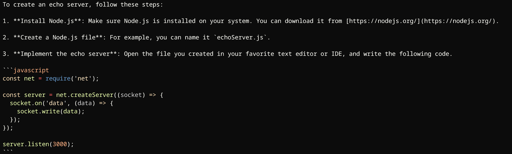

### Coldark
https://raw.githubusercontent.com/ArmandPhilippot/coldark-bat/e44750b2a9629dd12d8ed3ad9fd50c77232170b9/Coldark-Dark.tmTheme
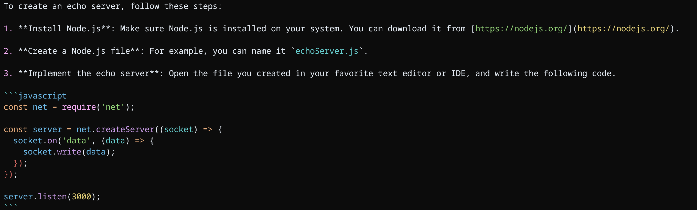

### Dracula
https://raw.githubusercontent.com/dracula/sublime/c2de0acf5af67042393cf70de68013153c043656/Dracula.tmTheme
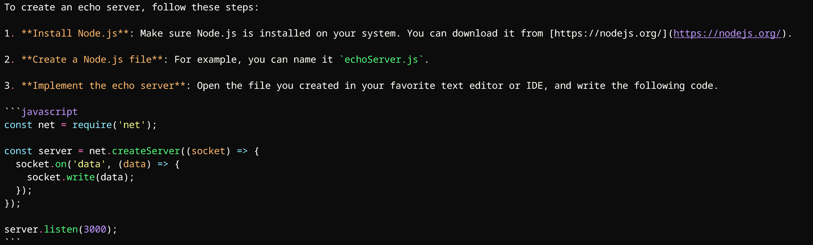

### GitHub
https://raw.githubusercontent.com/AlexanderEkdahl/github-sublime-theme/508740b2430c3c3a9e785fc93ee1d7c6f233af53/GitHub.tmTheme
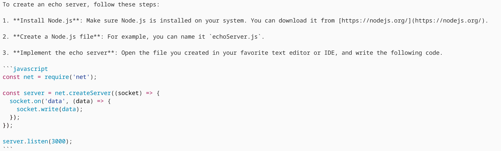

### gruvbox
#### Dark
https://raw.githubusercontent.com/subnut/gruvbox-tmTheme/64c47250e54298b91e2cf8d401320009aba9f991/gruvbox-dark.tmTheme
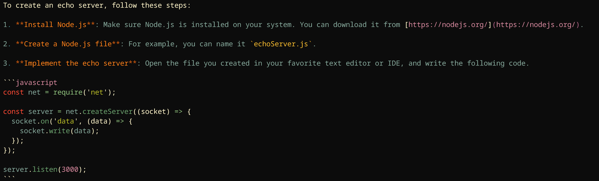

#### Light
https://raw.githubusercontent.com/subnut/gruvbox-tmTheme/64c47250e54298b91e2cf8d401320009aba9f991/gruvbox-light.tmTheme
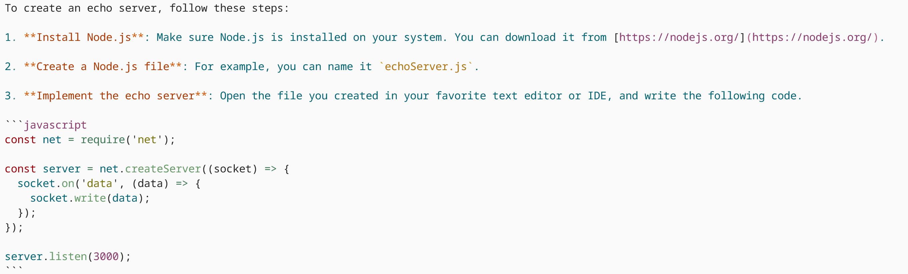

### OneHalf
#### Dark
https://raw.githubusercontent.com/sonph/onehalf/141c775ace6b71992305f144a8ab68e9a8ca4a25/sublimetext/OneHalfDark.tmTheme
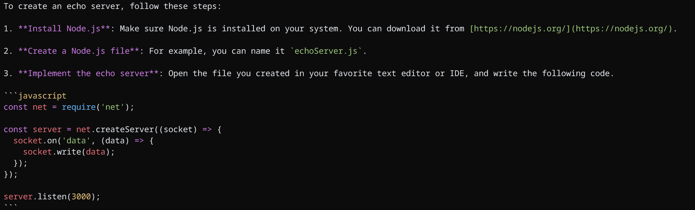

#### Light
https://raw.githubusercontent.com/sonph/onehalf/141c775ace6b71992305f144a8ab68e9a8ca4a25/sublimetext/OneHalfLight.tmTheme
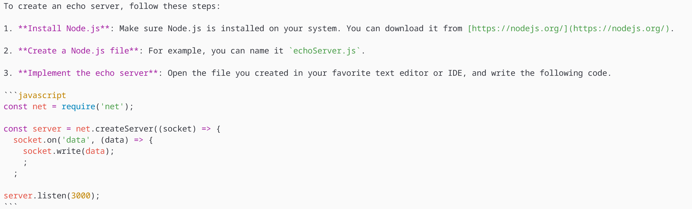

### Solarized
#### Dark
https://raw.githubusercontent.com/braver/Solarized/87e01090cggjf5fb821a234265b3138426ae84900e7/Solarized%20(dark).tmTheme
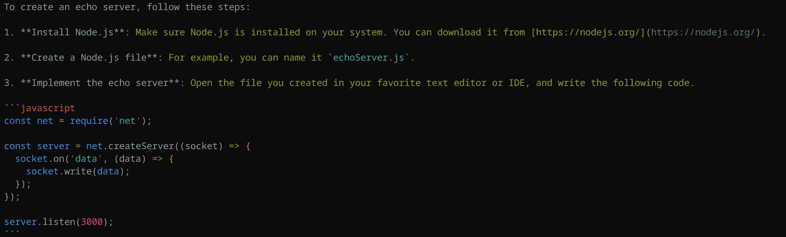

#### Light
https://raw.githubusercontent.com/braver/Solarized/87e01090cf5fb821a234265b3138426ae84900e7/Solarized%20(light).tmTheme
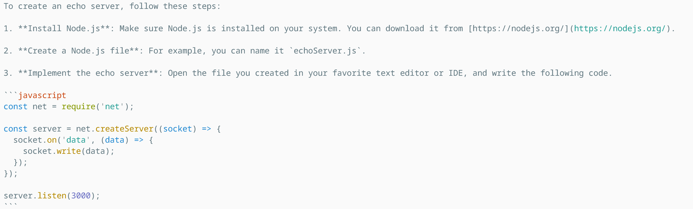

### Sublime Snazzy
https://raw.githubusercontent.com/greggb/sublime-snazzy/70343201f1d7539adbba3c79e2fe81c2559a0431/Sublime%20Snazzy.tmTheme
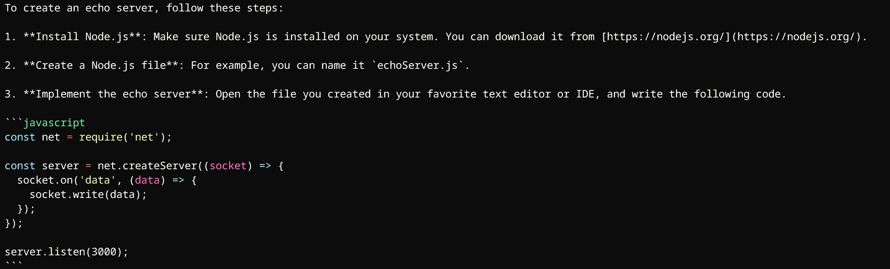

### TwoDark
https://raw.githubusercontent.com/erremauro/TwoDark/8e0f6fa5b59d196658a22288f519fd8320de4c87/TwoDark.tmTheme
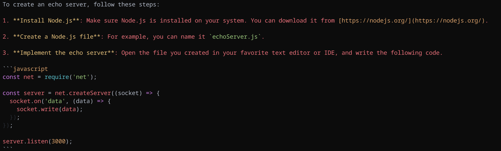

### Visual Studio Dark+
https://raw.githubusercontent.com/vidann1/visual-studio-dark-plus/01ee1e8e0dc578f3b4e8c0dbb6aa0279b4a26a40/Visual%20Studio%20Dark%2B.tmTheme
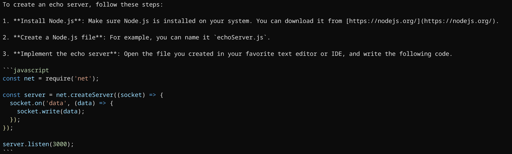

### Zenburn
https://raw.githubusercontent.com/colinta/zenburn/86d4ee7a1f884851a1d21d66249687f527fced32/zenburn.tmTheme
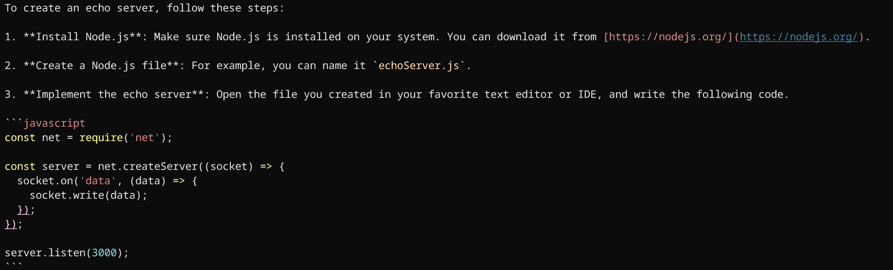