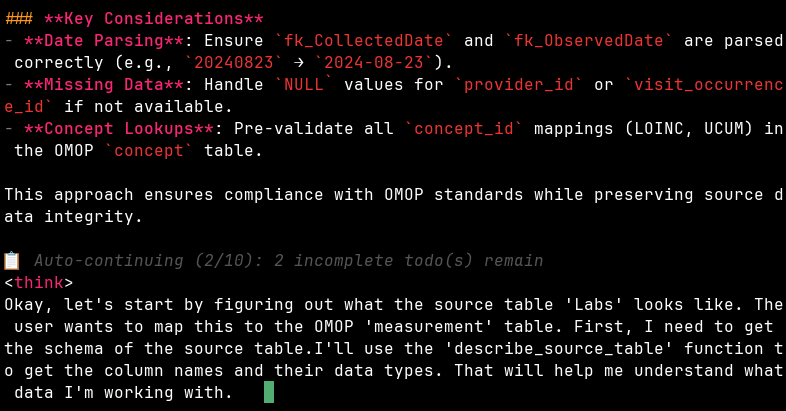

# Todo System

Loki's Todo System is a built-in task tracking feature designed to improve the reliability and effectiveness of LLM agents,
especially smaller models. It provides structured task management that helps models:

- Break complex tasks into manageable steps
- Track progress through multistep workflows
- Automatically continue work until all tasks are complete
- Avoid forgetting steps or losing context



## Quick Links
<!--toc:start-->
- [Why Use the Todo System?](#why-use-the-todo-system)
- [How It Works](#how-it-works)
- [Configuration Options](#configuration-options)
- [Available Tools](#available-tools)
- [Auto-Continuation](#auto-continuation)
- [Best Practices](#best-practices)
- [Example Workflow](#example-workflow)
- [Troubleshooting](#troubleshooting)
<!--toc:end-->

## Why Use the Todo System?
Smaller language models often struggle with:
- **Context drift**: Forgetting earlier steps in a multi-step task
- **Incomplete execution**: Stopping before all work is done
- **Lack of structure**: Jumping between tasks without clear organization

The Loki Todo System addresses these issues by giving the model explicit tools to plan, track, and verify task completion.
The system automatically prompts the model to continue when incomplete tasks remain, ensuring work gets finished.

## How It Works
1. **Planning Phase**: The model initializes a todo list with a goal and adds individual tasks
2. **Execution Phase**: The model works through tasks, marking each done immediately after completion
3. **Continuation Phase**: If incomplete tasks remain, the system automatically prompts the model to continue
4. **Completion**: When all tasks are marked done, the workflow ends naturally

The todo state is preserved across the conversation (and any compressions), and injected into continuation prompts,
keeping the model focused on remaining work.

## Configuration Options
The Todo System is configured per-agent in `<loki-config-dir>/agents/<agent-name>/config.yaml`:

| Setting                    | Type    | Default     | Description                                                                     |
|----------------------------|---------|-------------|---------------------------------------------------------------------------------|
| `auto_continue`            | boolean | `false`     | Enable the To-Do system for automatic continuation when incomplete todos remain |
| `max_auto_continues`       | integer | `10`        | Maximum number of automatic continuations before stopping                       |
| `inject_todo_instructions` | boolean | `true`      | Inject the default todo tool usage instructions into the agent's system prompt  |
| `continuation_prompt`      | string  | (see below) | Custom prompt used when auto-continuing                                         |

### Example Configuration
```yaml
# agents/my-agent/config.yaml
model: openai:gpt-4o
auto_continue: true              # Enable auto-continuation
max_auto_continues: 15           # Allow up to 15 automatic continuations
inject_todo_instructions: true   # Include todo instructions in system prompt
continuation_prompt: |           # Optional: customize the continuation prompt
  [CONTINUE]
  You have unfinished tasks. Proceed with the next pending item.
  Do not explain—just execute.
```

### Default Continuation Prompt
If `continuation_prompt` is not specified, the following default is used:

```
[SYSTEM REMINDER - TODO CONTINUATION]
You have incomplete tasks in your todo list. Continue with the next pending item.
Call tools immediately. Do not explain what you will do.
```

## Available Tools
When `inject_todo_instructions` is enabled (the default), agents have access to four built-in todo management tools:

### `todo__init`
Initialize a new todo list with a goal. Clears any existing todos.

**Parameters:**
- `goal` (string, required): The overall goal to achieve when all todos are completed

**Example:**
```json
{"goal": "Refactor the authentication module"}
```

### `todo__add`
Add a new todo item to the list.

**Parameters:**
- `task` (string, required): Description of the todo task

**Example:**
```json
{"task": "Extract password validation into separate function"}
```

**Returns:** The assigned task ID

### `todo__done`
Mark a todo item as done by its ID.

**Parameters:**
- `id` (integer, required): The ID of the todo item to mark as done

**Example:**
```json
{"id": 1}
```

### `todo__list`
Display the current todo list with status of each item.

**Parameters:** None

**Returns:** The full todo list with goal, progress, and item statuses

## Auto-Continuation
When `auto_continue` is enabled, Loki automatically sends a continuation prompt if:

1. The agent's response completes (model stops generating)
2. There are incomplete tasks in the todo list
3. The continuation count hasn't exceeded `max_auto_continues`
4. The response isn't identical to the previous continuation (prevents loops)

### What Gets Injected
Each continuation prompt includes:
- The continuation prompt text (default or custom)
- The current todo list state showing:
  - The goal
  - Progress (e.g., "3/5 completed")
  - Each task with status (✓ done, ○ pending)

**Example continuation context:**
```
[SYSTEM REMINDER - TODO CONTINUATION]
You have incomplete tasks in your todo list. Continue with the next pending item.
Call tools immediately. Do not explain what you will do.

Goal: Refactor the authentication module
Progress: 2/4 completed
  ✓ 1. Extract password validation into separate function
  ✓ 2. Add unit tests for password validation
  ○ 3. Update login handler to use new validation
  ○ 4. Update registration handler to use new validation
```

### Visual Feedback
During auto-continuation, you'll see a message in your terminal:
```
📋 Auto-continuing (3/10): 2 incomplete todo(s) remain
```

## Best Practices

### For Agent Developers
1. **Enable for complex workflows**: Use `auto_continue: true` for agents that handle multistep tasks
2. **Set reasonable limits**: Adjust `max_auto_continues` based on typical task complexity
3. **Customize the prompt**: If your agent needs specific continuation behavior, set a custom `continuation_prompt`

### For Model Behavior
The injected instructions tell models to:

1. **Always create a todo list before starting work**: This ensures planning happens upfront
2. **Mark each task done immediately after finishing**: Don't batch completions
3. **Add all planned steps before starting**: Complete planning before execution

### When to Use vs. Skip
**Use the Todo System when:**
- Tasks have 3+ distinct steps
- The model might lose track of progress
- You want guaranteed completion of all steps
- Working with smaller/less capable models

**Skip the Todo System when:**
- Single-step, simple tasks
- Interactive Q&A sessions
- The overhead of task tracking isn't worth it

## Example Workflow
Here's how a typical todo-driven workflow looks:

**User prompt:** "Add input validation to the user registration form"

**Model actions:**
```
1. todo__init(goal="Add input validation to user registration form")
2. todo__add(task="Analyze current registration form fields")
3. todo__add(task="Create validation rules for email field")
4. todo__add(task="Create validation rules for password field")
5. todo__add(task="Implement client-side validation")
6. todo__add(task="Add server-side validation")
7. todo__add(task="Write tests for validation logic")
```

**Model executes first task, then:**
```
8. todo__done(id=1)
9. [Proceeds with task 2...]
10. todo__done(id=2)
...
```

**If model stops with incomplete tasks:**
- System automatically sends continuation prompt
- Model sees remaining tasks and continues
- Repeats until all tasks are done or max continuations reached

## Troubleshooting

### Model Not Using Todo Tools
- Verify `inject_todo_instructions: true` in your agent config
- Check that the agent is properly loaded (not just a role)
- Some models may need explicit prompting to use the tools

### Too Many Continuations
- Lower `max_auto_continues` to a reasonable limit
- Check if the model is creating new tasks without completing old ones
- Ensure tasks are appropriately scoped (not too granular)

### Continuation Loop
The system detects when a model's response is identical to its previous continuation response and stops
automatically. If you're seeing loops:
- The model may be stuck; check if a task is impossible to complete
- Consider adjusting the `continuation_prompt` to be more directive

---

## Additional Docs
- [Agents](./AGENTS.md) — Full agent configuration guide
- [Function Calling](./function-calling/TOOLS.md) — How tools work in Loki
- [Sessions](./SESSIONS.md) — How conversation state is managed
