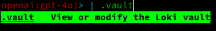

# The Loki Vault
The Loki vault lets users store sensitive secrets and credentials securely so that there's no plaintext secrets
anywhere in your configurations. 

It's based on the [G-Man library](https://github.com/Dark-Alex-17/gman) (which also comes in a binary format) which
functions as a universal secret management tool.


## Usage
The Loki vault can be used in one of two ways: via the CLI or via the REPL for interactive usage.

### CLI Usage
The vault is utilized from the CLI with the following flags:

```bash
--add-secret <SECRET_NAME>       Add a secret to the Loki vault
--get-secret <SECRET_NAME>       Decrypt a secret from the Loki vault and print the plaintext
--update-secret <SECRET_NAME>    Update an existing secret in the Loki vault
--delete-secret <SECRET_NAME>    Delete a secret from the Loki vault
--list-secrets                   List all secrets stored in the Loki vault
```
(The above is also documented in `loki --help`)

Loki will guide you through manipulating your secrets to make usage easier.

### REPL Usage
The vault can be access from within the Loki REPL using the `.vault` commands:




The manipulation of your vault is guided in the same way as the CLI usage, ensuring ease of use.

## Motivation
Loki is intended to be highly configurable and adaptable to many different use cases. This means that users of Loki
should be able to share configurations for agents, tools, roles, etc. with other users or even entire teams.

My objective is to encourage this, and to make it so that users can easily version their configurations using version
control. Good VCS hygiene dictates that one *never* commits secrets or sensitive information to a repository.

Since a number of files and configurations in Loki may contain sensitive information, the vault exists to solve this problem.

Users can either share the vault password with a team, making it so a single configuration can be pulled from VCS and used
by said team. Alternatively, each user can maintain their own vault password and expect other users to replace secret values
with their user-specific secrets.

## How it works
When you first start Loki, if you don't already have a vault password file, it will prompt you to create one. This file
houses the password that is used to encrypt and decrypt secrets within Loki. This file exists so that you are not prompted
for a password every time Loki attempts to decrypt a secret.

When you encrypt a secret, it uses the local provider for `gman` to securely store those secrets in the Loki vault file.
This file is typically located at your Loki configuration directory under `vault.yml`. If you open this file, you'll see a
bunch of gibberish. This is because all secrets are encrypted using the password you provided, meaning only you can decrypt them.

Secrets are specified in Loki configurations using the same variable templating as the [Jinja templating engine](https://jinja.palletsprojects.com/en/stable/):

```
{{some_variable}}
```

So whenever you want Loki to use a secret from the vault, you simply specify the secret name in this format in the applicable
file.

**Example:**
Suppose my vault has a secret called `GITHUB_TOKEN` in it, and I want to use that in the MCP configuration. Then, I simply replace
the expected value in my `mcp.json` with the templated secret:

```json
{
  "mcpServers": {
    "atlassian": {
      "command": "npx",
      "args": ["-y", "mcp-remote", "https://mcp.atlassian.com/v1/sse"]
    },
    "github": {
      "command": "docker",
      "args": [
        "run",
        "-i",
        "--rm",
        "-e",
        "GITHUB_PERSONAL_ACCESS_TOKEN",
        "ghcr.io/github/github-mcp-server"
      ],
      "env": {
        "GITHUB_PERSONAL_ACCESS_TOKEN": "{{GITHUB_TOKEN}}"
      }
    }
  }
}
```

At runtime, Loki will detect the templated secret and replace it with the decrypted value from the vault before executing.

## Supported Files
At the time of writing, the following files support Loki secret injection:

| File Type            | Description                       | Limitations                                                    |
|----------------------|-----------------------------------|----------------------------------------------------------------|
| `config.yaml`        | The main Loki configuration file  | Cannot use secret injection on the `vault_password_file` field |
| `functions/mcp.json` | The MCP server configuration file |                                                                |


Note that all paths are relative to the Loki configuration directory. The directory varies by system, so you can find yours by
running

```shell
dirname $(loki --info | grep config_file | awk '{print $2}')
```
