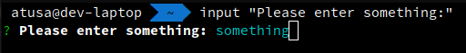
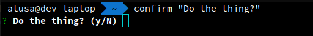
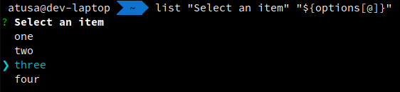
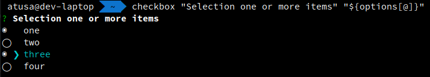
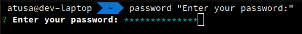
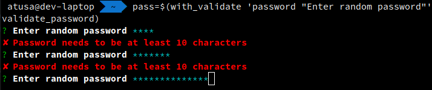
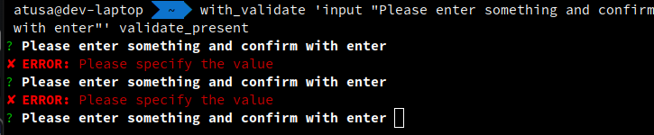

# Bash Prompt Helpers

When creating bash based tools, it's often helpful to prompt the user for input or confirmation.

Loki comes pre-packaged with a handful of prompt helpers for your bash-based tools. These helpers
can be used to prompt the user for various types of input, such as yes/no confirmations,
text input, and selections from a list.

The utility script is located at `functions/utils/prompt-utils.sh` within your Loki `functions` directory.

The Loki `functions` directory varies between machines, so you can find its location on your system by running the following command in your terminal:

```shell
loki --info | grep functions_dir | awk '{print $2}'
```

## Quick Links
<!--toc:start-->
- [Import The Prompt Utils Into Your Tools Script](#import-the-prompt-utils-into-your-tools-script)
- [Included Utility Functions](#included-utility-functions)
  - [input](#input)
  - [confirm](#confirm)
  - [list](#list)
  - [checkbox](#checkbox)
  - [password](#password)
  - [editor](#editor)
  - [with_validate](#with_validate)
  - [validate_present](#validate_present)
  - [detect_os](#detect_os)
  - [get_opener](#get_opener)
  - [open_link](#open_link)
  - [guard_operation](#guard_operation)
  - [guard_path](#guard_path)
  - [patch_file](#patch_file)
  - [error](#error)
  - [warn](#warn)
  - [info](#info)
  - [debug](#debug)
  - [trace](#trace)
  - [Colored Output](#colored-output)
<!--toc:end-->

---

## Import The Prompt Utils Into Your Tools Script
In order to use the bash prompt helpers in your bash scripts, you need to source the provided `prompt-utils.sh` script.
This script is pre-packaged with Loki and is located [here](../../assets/functions/utils/prompt-utils.sh).

When sourcing the file in your bash script, you use the `LLM_PROMPT_UTILS_FILE` environment variable that automatically 
populates the `functions/utils/prompt-utils.sh` path for you.

Thus, to properly source and enable all the bash prompt helpers in your Bash tools, add the following prelude to your
scripts:

```bash
source "$LLM_PROMPT_UTILS_FILE"
```

## Included Utility Functions
Below are the built-in bash prompt helpers that can be used to enhance user interaction with your tool scripts.

### input
Prompt for text input



**Example With Validation:**
```bash
text=$(with_validation 'input "Please enter something:"' validate_present 2>/dev/tty)
```

**Example Without Validation:**
```bash
text=$(input "Please enter something:" 2>/dev/tty)
```

### confirm
Show a confirm dialog with options for yes/no



**Example:**
```bash
confirmed=$(confirm "Do the thing?" 2>/dev/tty)
if [[ $confirmed == "0" ]]; then echo "No"; else echo "Yes"; fi
```

### list
Renders a text based list of options that can be selected by the user using up, down, and enter
keys that then returns the chosen option.



**Example:**
```bash
options=("one" "two" "three" "four")
choice=$(list "Select an item" "${options[@]}" 2>/dev/tty)
echo "Your choice: ${options[$choice]}"
```

### checkbox
Render a text based list of options, where multiple options can be selected by the user using down, up,
and enter keys that then returns the chosen options.



**Example:**
```bash
options=("one" "two" "three" "four")
checked=$(checkbox "Select one or more items" "${options[@]}" 2>/dev/tty)
echo "Your choices: ${checked}"
```

### password
Show a password prompt displaying stars for each character typed.



**Example With Validation:**
```bash
validate_password() {
  if [[ ${#1} -lt 10 ]]; then
    echo "Password must be at least 10 characters"
    exit 1
  fi
}
pass=$(with_validate 'password "Enter your password"' validate_password 2>/dev/tty)
```

**Example Without Validation:**
```bash
pass="$(password "Enter your password:" 2>/dev/tty)"
```

### editor
Open the default editor (`$EDITOR`); if none is set, default back to `vi`

**Example:**
```bash
text=$(editor "Please enter something in the editor" 2>/dev/tty)
echo -e "You wrote:\n${text}"
```

### with_validate
Evaluate the given prompt command with validation. This prompts the user for input until the
validation functions returns 0.



**Example:**
```bash
# Using the built-in 'validate_present' validator
text=$(with_validate 'input "Please enter something and confirm with enter"' validate_present 2>/dev/tty)

# Using a custom validator; e.g. for password
validate_password() {
  if [[ ${#1} -lt 10 ]]; then
    echo "Password needs to be at least 10 characters"
    exit 1
  fi
}
pass=$(with_validate 'password "Enter random password"' validate_password 2>/dev/tty)
```

### validate_present
Validate that the prompt returned a value.



**Example:**
```bash
text=$(with_validate 'input "Please enter something and confirm with enter"' validate_present 2>/dev/tty)
```

### detect_os
Detect the current OS.

Returns one of the following:

* `solaris`
* `macos`
* `linux`
* `bsd`
* `windows`
* `unknown`

**Example:**
```bash
detect_os
```

### get_opener
Determines the Os-specific file opening command (i.e. the command to open anything)

**Example:**
```bash
# Returns 'xdg-open'
get_opener
```

### open_link
Opens the given link in the default browser

**Example:**
```bash
open_link https://www.google.com
```

### guard_operation
Prompt for permission to run an operation.

Can be disabled by setting the environment variable `AUTO_CONFIRM`.

**Example:**
```bash
guard_operation "Execute SQL?"
_run_sql
```

### guard_path
Prompt for permission to perform path operations.

Can be disabled by setting the environment variable `AUTO_CONFIRM`.

**Example:***
```bash
guard_path "$target_path" "Remove '$target_path'?"
rm -rf "$target_path"
```

### patch_file
Patch a file and show a diff using the default diff viewer. Uses git diff syntax.

**Example:**
```bash
new_contents="$(patch_file "$path" file.patch)"
```

### error
Log an error


### warn
Log a warning


### info
Log info


### debug
Log a debug message


### trace
Log a trace message


### Colored Output
The following commands allow users to output text in specific colors.

* `red`
* `green`
* `gold`
* `blue`
* `magenta`
* `cyan`
* `white`

**Example:**
```bash
red "This will be red"
yellow "This will be yellow"
```
